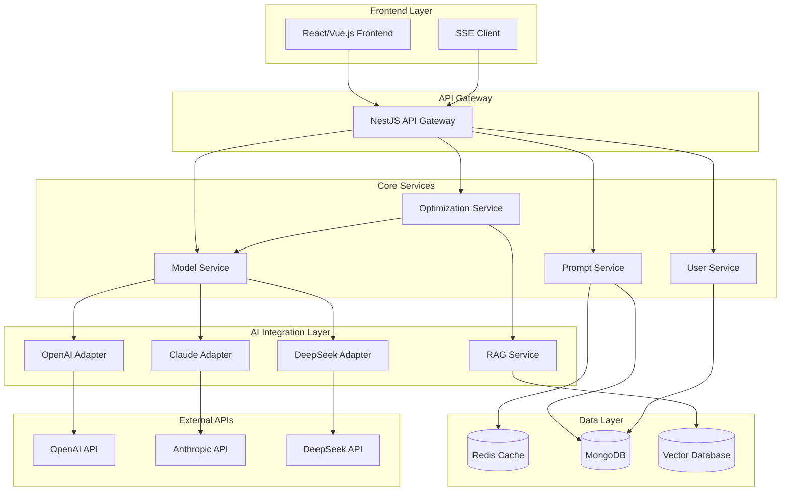

# Design Document

## Overview

AI提示词优化工具是一个现代化的全栈Web应用，采用微服务架构设计。系统通过分析用户输入的提示词，结合不同AI模型的特性和最佳实践，提供智能化的优化建议。核心设计理念是模块化、可扩展性和高性能。

## Architecture

### 系统架构图



### 技术栈选择

**后端技术栈:**
- **框架**: NestJS (TypeScript) - 提供企业级架构和依赖注入
- **数据库**: MongoDB - 灵活的文档存储，适合提示词和优化记录
- **缓存**: Redis - 高性能缓存和会话管理
- **任务队列**: Bull Queue (可选) - 处理长时间运行的优化任务

**前端技术栈:**
- **框架**: React/Next.js 或 Vue.js/Nuxt.js
- **状态管理**: Zustand
- **UI组件**: Ant Design 或 Element Plus
- **HTTP客户端**: Axios 或 Fetch API
- **实时通信**: Server-Sent Events (SSE)

**RAG技术选型:**
- **向量数据库**: Pinecone (云端) 或 Chroma (自托管)
- **嵌入模型**: OpenAI text-embedding-3-small 或 Sentence Transformers
- **检索策略**: 混合检索 (向量 + 关键词)

## Components and Interfaces

### 1. 前端组件架构

```typescript
// 主要组件结构 - 使用 hooks 模式
interface ComponentStructure {
  // 页面组件 hooks
  pages: {
    useHomePage: () => HomePageState;
    useOptimizationPage: () => OptimizationPageState;
    useHistoryPage: () => HistoryPageState;
    useSettingsPage: () => SettingsPageState;
  };
  
  // 功能组件 hooks
  components: {
    usePromptEditor: (props: PromptEditorProps) => PromptEditorState;
    useModelSelector: (props: ModelSelectorProps) => ModelSelectorState;
    useOptimizationResult: (props: OptimizationResultProps) => OptimizationResultState;
    useHistoryList: (props: HistoryListProps) => HistoryListState;
    useRoleSettings: (props: RoleSettingsProps) => RoleSettingsState;
  };
  
  // 工具组件 hooks
  utils: {
    usePromptValidator: (props: ValidatorProps) => ValidatorState;
    useDiffViewer: (props: DiffViewerProps) => DiffViewerState;
    useExportTools: (props: ExportToolsProps) => ExportToolsState;
  };
}

// Zustand 状态管理
interface AppStore {
  // 提示词状态
  prompts: {
    current: Prompt | null;
    history: Prompt[];
    isOptimizing: boolean;
  };
  
  // 用户状态
  user: {
    profile: User | null;
    preferences: UserPreferences;
    apiKeys: Record<string, string>;
  };
  
  // UI状态
  ui: {
    selectedModel: AIModel | null;
    activeTab: string;
    isLoading: boolean;
  };
  
  // Actions
  actions: {
    optimizePrompt: (request: OptimizationRequest) => Promise<void>;
    savePrompt: (prompt: Prompt) => Promise<void>;
    loadHistory: () => Promise<void>;
    updatePreferences: (preferences: UserPreferences) => Promise<void>;
  };
}
```

### 2. 后端服务接口

```typescript
// API接口定义
interface APIEndpoints {
  // 提示词优化相关
  '/api/prompts': {
    POST: (data: OptimizationRequest) => OptimizationResponse;
    GET: (userId: string) => PromptHistory[];
  };
  
  // 模型管理
  '/api/models': {
    GET: () => SupportedModel[];
    POST: (modelConfig: ModelConfig) => ModelValidationResult;
  };
  
  // 用户管理
  '/api/users': {
    GET: (userId: string) => UserProfile;
    PUT: (userId: string, data: UserUpdate) => UserProfile;
  };
  
  // 实时优化进度
  '/api/optimization/stream': SSEHandler;
}
```

### 3. 核心服务接口

```typescript
// 提示词优化服务
interface PromptOptimizationService {
  optimizePrompt(request: OptimizationRequest): Promise<OptimizationResult>;
  analyzePrompt(prompt: string): Promise<PromptAnalysis>;
  validatePrompt(prompt: string, model: AIModel): Promise<ValidationResult>;
  generateSuggestions(prompt: string, context: OptimizationContext): Promise<Suggestion[]>;
}

// 模型适配器接口
interface ModelAdapter {
  name: string;
  optimize(prompt: string, context: OptimizationContext): Promise<OptimizedPrompt>;
  validate(prompt: string): Promise<ValidationResult>;
  getModelSpecificRules(): OptimizationRule[];
  formatForModel(prompt: PromptStructure): string;
}

// RAG服务接口
interface RAGService {
  searchBestPractices(query: string): Promise<BestPractice[]>;
  indexDocument(document: Document): Promise<void>;
  generateContextualSuggestions(prompt: string): Promise<Suggestion[]>;
}

// SSE服务接口
interface SSEService {
  createOptimizationStream(sessionId: string): EventSource;
  sendProgress(sessionId: string, progress: OptimizationProgress): void;
  sendResult(sessionId: string, result: OptimizationResult): void;
  sendError(sessionId: string, error: OptimizationError): void;
  closeStream(sessionId: string): void;
}

// SSE事件类型
interface SSEEvent {
  type: 'progress' | 'result' | 'error' | 'complete';
  data: OptimizationProgress | OptimizationResult | OptimizationError;
  timestamp: number;
}

// 优化进度
interface OptimizationProgress {
  stage: 'analyzing' | 'optimizing' | 'validating' | 'formatting';
  percentage: number;
  message: string;
  currentStep?: string;
}
```

## Data Models

### 1. 核心数据模型

```typescript
// 提示词模型
interface Prompt {
  id: string;
  userId: string;
  originalText: string;
  optimizedText: string;
  targetModel: AIModel;
  messageRole: MessageRole;
  systemPrompt?: string;
  optimizationRules: OptimizationRule[];
  createdAt: Date;
  updatedAt: Date;
}

// 优化请求模型
interface OptimizationRequest {
  prompt: string;
  targetModel: AIModel;
  messageRole: MessageRole;
  systemPrompt?: string;
  optimizationLevel: 'basic' | 'advanced' | 'expert';
  customRules?: OptimizationRule[];
}

// 优化结果模型
interface OptimizationResult {
  id: string;
  originalPrompt: string;
  optimizedPrompt: string;
  improvements: Improvement[];
  confidence: number;
  appliedRules: OptimizationRule[];
  suggestions: Suggestion[];
  estimatedTokens: TokenEstimate;
}

// AI模型配置
interface AIModel {
  id: string;
  name: string;
  provider: 'openai' | 'anthropic' | 'deepseek';
  version: string;
  maxTokens: number;
  supportedRoles: MessageRole[];
  optimizationRules: OptimizationRule[];
  apiEndpoint: string;
}

// 用户模型
interface User {
  id: string;
  email: string;
  preferences: UserPreferences;
  apiKeys: Record<string, string>;
  usage: UsageStats;
  createdAt: Date;
}
```

### 2. 数据库Schema设计

```javascript
// MongoDB Collections

// prompts collection
{
  _id: ObjectId,
  userId: ObjectId,
  originalText: String,
  optimizedText: String,
  targetModel: {
    id: String,
    name: String,
    provider: String
  },
  messageRole: String,
  systemPrompt: String,
  optimizationMetadata: {
    appliedRules: [String],
    confidence: Number,
    improvements: [{
      type: String,
      description: String,
      impact: String
    }]
  },
  createdAt: Date,
  updatedAt: Date
}

// users collection
{
  _id: ObjectId,
  email: String,
  preferences: {
    defaultModel: String,
    optimizationLevel: String,
    autoSave: Boolean
  },
  apiKeys: {
    openai: String,
    anthropic: String,
    deepseek: String
  },
  usage: {
    totalOptimizations: Number,
    monthlyUsage: Number,
    lastUsed: Date
  },
  createdAt: Date
}

// optimization_rules collection
{
  _id: ObjectId,
  name: String,
  description: String,
  category: String,
  applicableModels: [String],
  ruleLogic: {
    pattern: String,
    replacement: String,
    condition: String
  },
  priority: Number,
  isActive: Boolean
}
```

## Error Handling

### 1. 错误分类和处理策略

```typescript
// 错误类型定义
enum ErrorType {
  VALIDATION_ERROR = 'VALIDATION_ERROR',
  API_ERROR = 'API_ERROR',
  RATE_LIMIT_ERROR = 'RATE_LIMIT_ERROR',
  AUTHENTICATION_ERROR = 'AUTHENTICATION_ERROR',
  OPTIMIZATION_ERROR = 'OPTIMIZATION_ERROR',
  SYSTEM_ERROR = 'SYSTEM_ERROR'
}

// 错误处理中间件
class ErrorHandler {
  static handle(error: AppError): ErrorResponse {
    switch (error.type) {
      case ErrorType.VALIDATION_ERROR:
        return this.handleValidationError(error);
      case ErrorType.API_ERROR:
        return this.handleAPIError(error);
      case ErrorType.RATE_LIMIT_ERROR:
        return this.handleRateLimitError(error);
      default:
        return this.handleGenericError(error);
    }
  }
}
```

### 2. 重试和降级策略

```typescript
// 重试配置
interface RetryConfig {
  maxRetries: number;
  backoffStrategy: 'exponential' | 'linear';
  retryableErrors: ErrorType[];
}

// 降级策略
interface FallbackStrategy {
  primaryService: string;
  fallbackServices: string[];
  fallbackConditions: FallbackCondition[];
}
```

## Testing Strategy

### 1. 测试层级

```typescript
// 单元测试
describe('PromptOptimizationService', () => {
  it('should optimize basic prompts correctly', async () => {
    // 测试基础优化功能
  });
  
  it('should handle model-specific optimizations', async () => {
    // 测试模型特定优化
  });
});

// 集成测试
describe('API Integration', () => {
  it('should handle end-to-end optimization flow', async () => {
    // 测试完整的优化流程
  });
});

// E2E测试
describe('User Journey', () => {
  it('should allow user to optimize prompt and view results', async () => {
    // 测试用户完整使用流程
  });
});
```

### 2. 性能测试

```typescript
// 负载测试配置
interface LoadTestConfig {
  concurrentUsers: number;
  requestsPerSecond: number;
  testDuration: string;
  endpoints: string[];
}

// 性能指标
interface PerformanceMetrics {
  responseTime: {
    p50: number;
    p95: number;
    p99: number;
  };
  throughput: number;
  errorRate: number;
  resourceUsage: {
    cpu: number;
    memory: number;
    database: number;
  };
}
```

### 3. 测试数据管理

```typescript
// 测试数据工厂
class TestDataFactory {
  static createPrompt(overrides?: Partial<Prompt>): Prompt;
  static createUser(overrides?: Partial<User>): User;
  static createOptimizationRequest(overrides?: Partial<OptimizationRequest>): OptimizationRequest;
}

// Mock服务
class MockAIService implements ModelAdapter {
  async optimize(prompt: string): Promise<OptimizedPrompt> {
    // 返回模拟的优化结果
  }
}
```

## Security Considerations

### 1. 数据安全

- **API密钥管理**: 使用环境变量和密钥管理服务
- **数据加密**: 敏感数据在传输和存储时加密
- **访问控制**: 基于角色的访问控制(RBAC)

### 2. API安全

- **认证**: JWT token认证
- **授权**: 细粒度权限控制
- **限流**: API调用频率限制
- **输入验证**: 严格的输入验证和清理

### 3. 隐私保护

- **数据最小化**: 只收集必要的用户数据
- **数据匿名化**: 在可能的情况下匿名化处理数据
- **用户控制**: 用户可以删除自己的数据

## Deployment and Scalability

### 1. 部署架构

```yaml
# Docker Compose 示例
version: '3.8'
services:
  frontend:
    build: ./frontend
    ports:
      - "3000:3000"
  
  backend:
    build: ./backend
    ports:
      - "3001:3001"
    environment:
      - MONGODB_URI=${MONGODB_URI}
      - REDIS_URI=${REDIS_URI}
  
  mongodb:
    image: mongo:latest
    volumes:
      - mongodb_data:/data/db
  
  redis:
    image: redis:alpine
    volumes:
      - redis_data:/data
```

### 2. 扩展策略

- **水平扩展**: 支持多实例部署
- **缓存策略**: 多层缓存提高性能
- **数据库优化**: 索引优化和分片策略
- **CDN集成**: 静态资源CDN加速